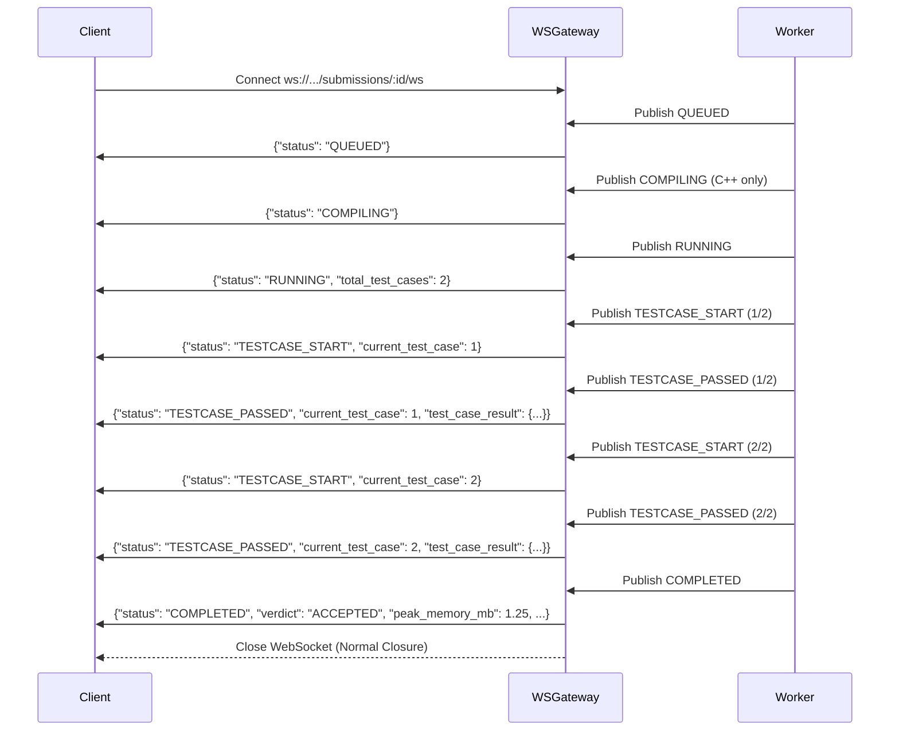

# 📡 SpeedCode Remote Runtime Engine - API Specification

This document details the REST Gateway and WebSocket streaming specifications for Phase 2 of the SpeedCode Remote Runtime Engine.

---

## 🌐 Base URL
```
http://localhost:8080/api/v1
```

---

## 📑 Endpoints Overview

| Method | Endpoint | Description |
| :--- | :--- | :--- |
| `POST` | `/api/v1/submissions` | Submit a code evaluation job (Asynchronous, 202 Accepted) |
| `GET` | `/api/v1/submissions/:id` | Fetch current or final submission state and testcase results |
| `GET` | `/api/v1/submissions/:id/ws` | WebSocket subscription endpoint for live real-time event streaming |
| `GET` | `/api/v1/health` | Healthcheck and queue depth status |

---

## 1. Submit Code Job
Submit a source code payload to be enqueued and evaluated across one or more testcases.

- **URL**: `/api/v1/submissions`
- **Method**: `POST`
- **Headers**:
  - `Content-Type: application/json`

### Request Payload (`SubmitRequest`)
```json
{
  "language": "python3",
  "code": "a, b = map(int, input().split())\nprint(a + b)",
  "time_limit_ms": 2000,
  "memory_limit_mb": 128,
  "cpu_quota": 1.0,
  "pids_limit": 32,
  "max_output_bytes": 1048576,
  "sandbox_type": "auto",
  "test_cases": [
    {
      "id": "tc-1",
      "input": "5 7\n",
      "expected_output": "12\n",
      "is_hidden": false
    },
    {
      "id": "tc-2",
      "input": "100 250\n",
      "expected_output": "350\n",
      "is_hidden": true
    }
  ]
}
```

### Parameters
| Field | Type | Required | Default | Description |
| :--- | :--- | :--- | :--- | :--- |
| `language` | string | **Yes** | — | `cpp`, `python3` (aliases: `c++`, `python`) |
| `code` | string | **Yes** | — | Raw source code string |
| `time_limit_ms` | int64 | No | `2000` | Wall-clock execution timeout in milliseconds (max `10000`) |
| `memory_limit_mb` | int64 | No | `128` | Memory limit in Megabytes (max `1024`) |
| `cpu_quota` | float64 | No | `1.0` | CPU quota limit (e.g. `1.0` = 1 full core) |
| `pids_limit` | int64 | No | `32` | Max child processes/threads (fork bomb guard) |
| `max_output_bytes` | int64 | No | `1048576` | Max stdout/stderr capture buffer (1MB) |
| `sandbox_type` | string | No | `auto` | `auto`, `native`, `docker`, `dev_process` |
| `test_cases` | array | No | `[]` | Array of testcases with input and expected output |

### Response: `202 Accepted`
```json
{
  "submission_id": "sub-a1b2c3d4e5f6",
  "status": "QUEUED",
  "ws_url": "/api/v1/submissions/sub-a1b2c3d4e5f6/ws",
  "enqueued_at": "2026-08-30T10:45:00.000Z"
}
```

### Error Responses
- **`400 Bad Request`**: Invalid JSON or unsupported programming language.
  ```json
  {
    "error": "Bad Request",
    "message": "unsupported language: 'brainfuck' (supported: cpp, python3)"
  }
  ```
- **`429 Too Many Requests`** (Backpressure Guard):
  ```json
  {
    "error": "Too Many Requests",
    "message": "Queue capacity exceeded (current depth: 501, max: 500); please retry shortly"
  }
  ```
  *Response Header:* `Retry-After: 5`

---

## 2. Real-Time WebSocket Streaming
Connect over WebSockets to receive live updates as the worker compiles code, evaluates individual testcases, and computes aggregate metrics.

- **URL**: `ws://localhost:8080/api/v1/submissions/:submission_id/ws`
- **Protocol**: Standard WebSocket (Text frames, JSON encoded)

### Streamed Event Sequence



### Event JSON Schemas

#### Event: `QUEUED`
```json
{
  "submission_id": "sub-a1b2c3d4e5f6",
  "status": "QUEUED",
  "timestamp": "2026-08-30T10:45:00.100Z"
}
```

#### Event: `COMPILING` (C++ only)
```json
{
  "submission_id": "sub-a1b2c3d4e5f6",
  "status": "COMPILING",
  "timestamp": "2026-08-30T10:45:00.250Z"
}
```

#### Event: `TESTCASE_START`
```json
{
  "submission_id": "sub-a1b2c3d4e5f6",
  "status": "TESTCASE_START",
  "current_test_case": 1,
  "total_test_cases": 2,
  "timestamp": "2026-08-30T10:45:00.400Z"
}
```

#### Event: `TESTCASE_PASSED` / `TESTCASE_FAILED`
```json
{
  "submission_id": "sub-a1b2c3d4e5f6",
  "status": "TESTCASE_PASSED",
  "current_test_case": 1,
  "total_test_cases": 2,
  "wall_time_ms": 12.45,
  "peak_memory_mb": 1.15,
  "test_case_result": {
    "test_case_id": "tc-1",
    "index": 1,
    "verdict": "ACCEPTED",
    "exit_code": 0,
    "stdout": "12\n",
    "stderr": "",
    "wall_time_ms": 12.45,
    "cpu_time_ms": 11.20,
    "peak_memory_mb": 1.15,
    "oom_killed": false
  },
  "timestamp": "2026-08-30T10:45:00.420Z"
}
```

#### Event: `COMPLETED` (Final State)
```json
{
  "submission_id": "sub-a1b2c3d4e5f6",
  "status": "COMPLETED",
  "verdict": "ACCEPTED",
  "current_test_case": 2,
  "total_test_cases": 2,
  "wall_time_ms": 28.90,
  "cpu_time_ms": 24.10,
  "peak_memory_mb": 1.25,
  "timestamp": "2026-08-30T10:45:00.500Z"
}
```

---

## 3. Get Submission State
Fetch current execution status or final evaluation report.

- **URL**: `/api/v1/submissions/:submission_id`
- **Method**: `GET`

### Response: `200 OK`
```json
{
  "submission_id": "sub-a1b2c3d4e5f6",
  "status": "COMPLETED",
  "verdict": "ACCEPTED",
  "language": "python3",
  "total_test_cases": 2,
  "passed_test_cases": 2,
  "peak_memory_mb": 1.25,
  "total_cpu_time_ms": 24.10,
  "total_wall_time_ms": 28.90,
  "results": [
    {
      "test_case_id": "tc-1",
      "index": 1,
      "verdict": "ACCEPTED",
      "exit_code": 0,
      "stdout": "12\n",
      "stderr": "",
      "wall_time_ms": 12.45,
      "cpu_time_ms": 11.20,
      "peak_memory_mb": 1.15,
      "oom_killed": false
    },
    {
      "test_case_id": "tc-2",
      "index": 2,
      "verdict": "ACCEPTED",
      "exit_code": 0,
      "stdout": "",
      "stderr": "",
      "wall_time_ms": 16.45,
      "cpu_time_ms": 12.90,
      "peak_memory_mb": 1.25,
      "oom_killed": false
    }
  ],
  "created_at": "2026-08-30T10:45:00.000Z",
  "updated_at": "2026-08-30T10:45:00.500Z",
  "completed_at": "2026-08-30T10:45:00.500Z"
}
```

---

## 4. Healthcheck Endpoint
Monitor cluster health and pending task queue depth.

- **URL**: `/api/v1/health`
- **Method**: `GET`

### Response: `200 OK`
```json
{
  "status": "healthy",
  "queue_depth": 0,
  "timestamp": "2026-08-30T10:45:01Z"
}
```
